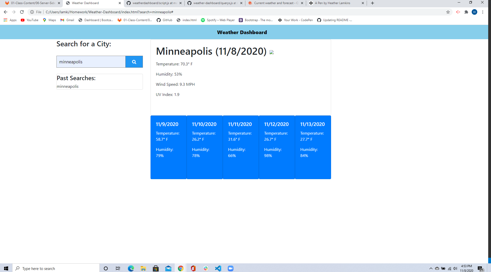

# Weather-Dashboard

## Overview
A website that will show you the current weather in a city when you search the city name, using the Open Weather API to obtain data. It will also show you the next five days of weather and will log past searches in to local storage.

## Screenshot

## Link to Live Page
[Weather Dashboard](https://hlamkins.github.io/Weather-Dashboard/)

## Project Status
This project has issues with the images loading that need to be worked on and maybe some additional styling.